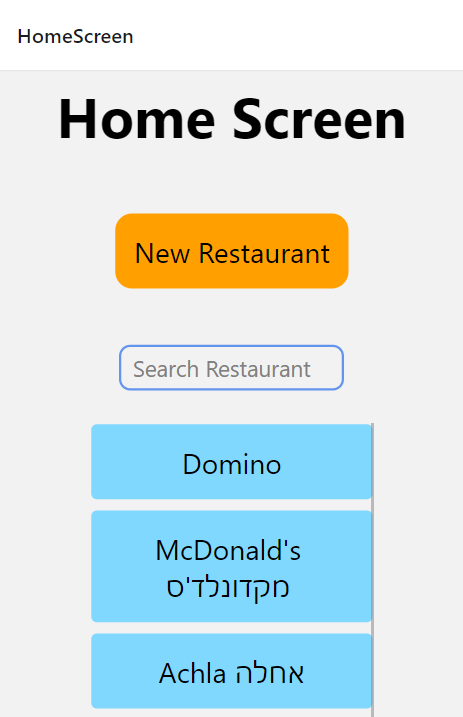
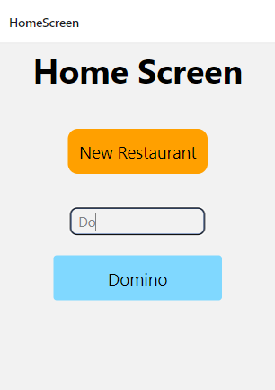
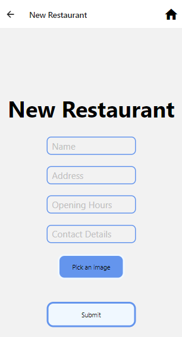
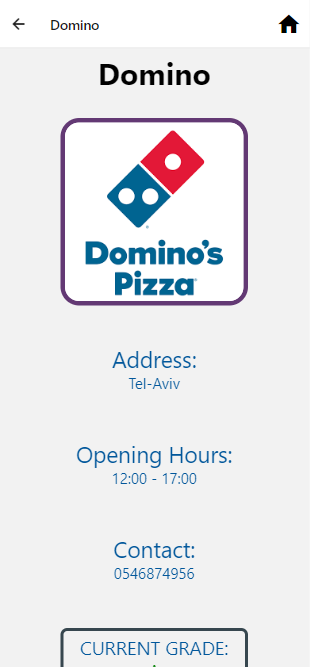
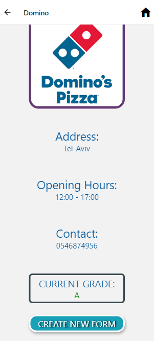
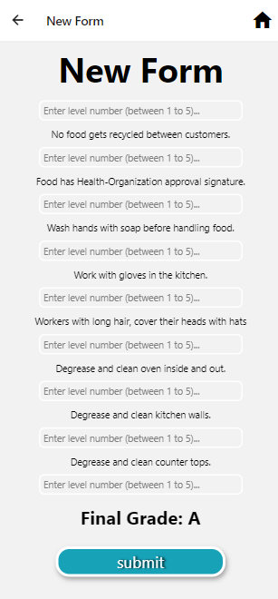

# **Sanitation App**

All rights reserved - Shir Segev and Avial Cohen Israel

 

Final project in Operation Systems course.
React-native, nodejs and MongoDB

This app is for inspector in the sanitation department, to add and store data of restaurants sanitation.

## <b>Screen shots from the app:</b>

 

## Home Screen

All the restaurant in the app:

- There is a search bar, for searching a restaurant in the app.
  
- There is a button to add a new restaurant to the app.
  

## New Restaurant Screen

To add a new restaurant:

- The user can upload an image of that restaurant.
  
- There is an home icon above in the header as well, that by clicking on it, it will navigate to the home screen.
  

## Restaurant Details Screen

All the Details of a current restaurant:

- Contains- name, image, address, opening hours, contact details and the current sanitation grade.
  
- There is a button for adding a new sanitation test form to that restaurant.

 
 

## New Form Screen

Sanitation test form for restaurant that the inspector needs to fill:

- By clicking the submit button, the app calculates the sanitation grade of that restaurant.

 
